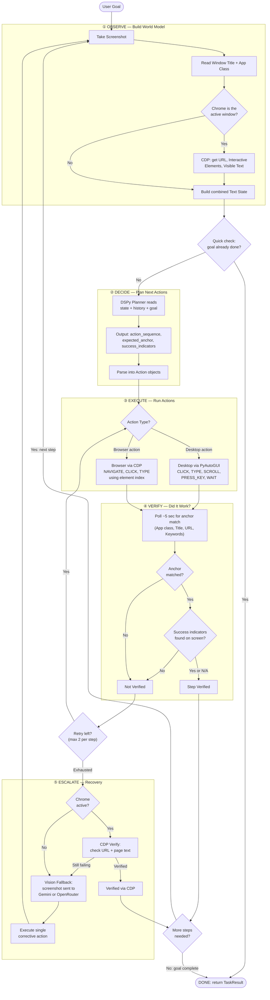

# DeskPilot — State Machine Diagram

> The agent runs an **O.D.E.V** loop: **Observe → Decide → Execute → Verify**, with an **Escalate** recovery path when verification fails.

---

## Main Agent Loop

---

## Phase Details

| Phase | What Happens | Key Code |
|-------|-------------|----------|
| **① OBSERVE** | Screenshot saved to `runs/<run_id>/step_XXX.png`. Desktop state via `xdotool` / `xprop`. If Chrome is active, CDP gives URL, indexed interactive elements, and visible text. | `agent/core.py`, `perception/browser_state.py`, `execution/desktop_controller.py` |
| **② DECIDE** | DSPy `ChainOfThought` planner outputs a semicolon-separated action sequence, a soft anchor (expected window title / URL), and success indicators. App knowledge loaded from `configs/xfce_apps.yaml`. | `agent/planner.py` |
| **③ EXECUTE** | Desktop actions run through PyAutoGUI on `DISPLAY=:99`. Browser actions use Playwright CDP — the same `FIND_ELEMENTS_JS` ensures element indices match between OBSERVE and EXECUTE. | `execution/actions.py`, `execution/browser_controller.py` |
| **④ VERIFY** | Polls for ~5 sec checking: app class match → window title match → URL match → keyword intersection. If anchor found + success indicators present → verified. Otherwise → retry or escalate. | `agent/core.py` |
| **⑤ ESCALATE** | **Layer 1 — CDP:** re-check URL and page text without a screenshot. **Layer 2 — Vision:** send screenshot to Gemini or OpenRouter, get back one corrective action, execute it, then loop back to OBSERVE. Forced if `consecutive_failures >= 3`. | `llm/gemini_client.py`, `llm/openrouter_client.py` |

---

## Key Design Rules

- **Index-based browser targeting** — interactive elements are numbered `[0], [1], …` by a shared JS snippet (`FIND_ELEMENTS_JS`). The planner references these indices; the executor clicks/types by the same indices.
- **Autocomplete safety** — type in one step, pick the dropdown option in the *next* step (indices go stale after DOM changes).
- **Popup-first** — always dismiss popups/modals before interacting with content underneath.
- **Vision is expensive** — it is only called after local + CDP verification both fail, never in the normal happy path.
