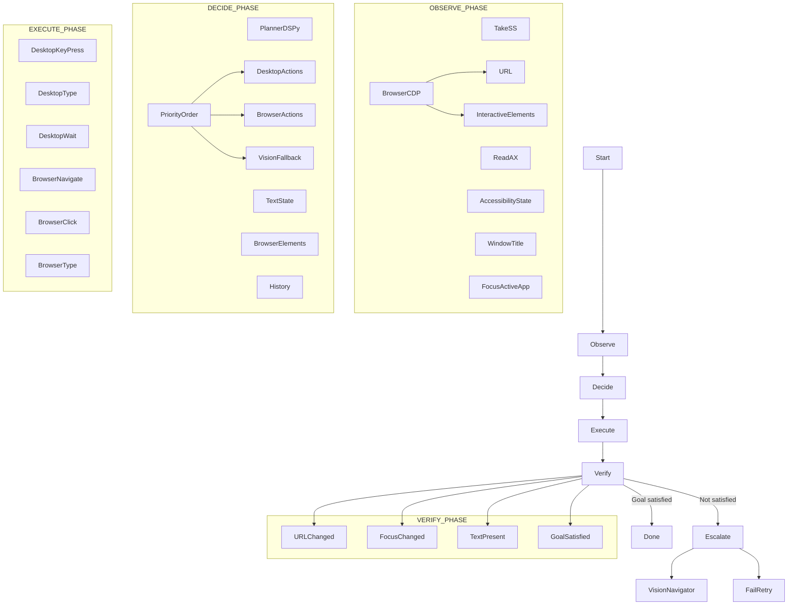

```mermaid
flowchart TD
    Start --> Observe
    Observe --> Decide
    Decide --> Execute
    Execute --> Verify
    Verify -->|Goal satisfied| Done
    Verify -->|Not satisfied| Escalate
    Escalate --> VisionNavigator
    Escalate --> FailRetry

    subgraph OBSERVE_PHASE
        TakeSS
        ReadAX
        AccessibilityState
        WindowTitle
        FocusActiveApp
        BrowserCDP
        URL
        InteractiveElements

        BrowserCDP --> URL
        BrowserCDP --> InteractiveElements
    end

    subgraph DECIDE_PHASE
        PlannerDSPy
        TextState
        BrowserElements
        History
        PriorityOrder
        DesktopActions
        BrowserActions
        VisionFallback

        PriorityOrder --> DesktopActions
        PriorityOrder --> BrowserActions
        PriorityOrder --> VisionFallback
    end

    subgraph EXECUTE_PHASE
        DesktopKeyPress
        DesktopType
        DesktopWait
        BrowserNavigate
        BrowserClick
        BrowserType
    end

    subgraph VERIFY_PHASE
        URLChanged
        FocusChanged
        TextPresent
        GoalSatisfied
    end

    Verify --> URLChanged
    Verify --> FocusChanged
    Verify --> TextPresent
    Verify --> GoalSatisfied

```
